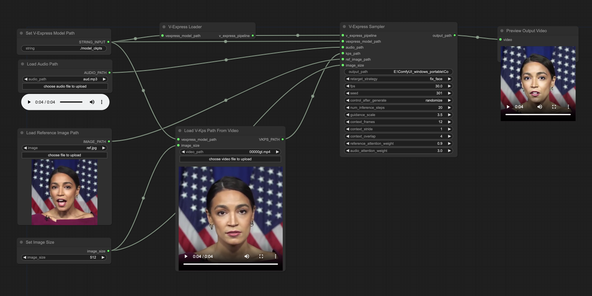

# **_V-Express: Conditional Dropout for Progressive Training of Portrait Video Generation_**

<a href='https://tenvence.github.io/p/v-express/'></a>
<a href='https://tenvence.github.io/p/v-express/'></a>
<a href='https://huggingface.co/tk93/V-Express'></a>

<!-- [](https://github.com/tencent-ailab/IP-Adapter/) -->

---

## Introduction

In the field of portrait video generation, the use of single images to generate portrait videos has become increasingly prevalent.
A common approach involves leveraging generative models to enhance adapters for controlled generation.
However, control signals can vary in strength, including text, audio, image reference, pose, depth map, etc.
Among these, weaker conditions often struggle to be effective due to interference from stronger conditions, posing a challenge in balancing these conditions.
In our work on portrait video generation, we identified audio signals as particularly weak, often overshadowed by stronger signals such as pose and original image.
However, direct training with weak signals often leads to difficulties in convergence.
To address this, we propose V-Express, a simple method that balances different control signals through a series of progressive drop operations.
Our method gradually enables effective control by weak conditions, thereby achieving generation capabilities that simultaneously take into account pose, input image, and audio.

## Workflow



## Installation

1. Clone this repo into the Your ComfyUI root directory\ComfyUI\custom_nodes\ and install dependent Python packages from [here](https://github.com/tencent-ailab/V-Express#installation):

   ```shell
   cd Your_ComfyUI_root_directory\ComfyUI\custom_nodes\

   git clone https://github.com/tiankuan93/ComfyUI-V-Express

   pip install -r requirements.txt
   ```

   If you are using ComfyUI_windows_portable , you should use `.\python_embeded\python.exe -m pip` to replace `pip` for installation.

   If you got error regards insightface, you may find solution [here](https://www.youtube.com/watch?v=vCCVxGtCyho).

   - first, you should download .whl file [here](https://github.com/Gourieff/Assets/tree/main/Insightface)
   - then, install it by `.\python_embeded\python.exe -m pip install --no-deps --target=\your_path_of\python_embeded\Lib\site-packages [path-to-wheel]`

2. Download V-Express models and other needed models:

   - [model_ckpts](https://huggingface.co/tk93/V-Express)
   - You need to replace the **model_ckpts** folder with the downloaded **V-Express/model_ckpts**. Then you should download and put all `.bin` model to `model_ckpts/v-express` directory, which includes `audio_projection.bin`, `denoising_unet.bin`, `motion_module.bin`, `reference_net.bin`, and `v_kps_guider.bin`. The final **model_ckpts** folder is as follows:

   ```text
   ./model_ckpts/
   |-- insightface_models
   |-- sd-vae-ft-mse
   |-- stable-diffusion-v1-5
   |-- v-express
   |-- wav2vec2-base-960h
   ```

3. You should put the files in input directory into the Your ComfyUI Input root `directory\ComfyUI\input\`.
4. You need to set `output_path` as `directory\ComfyUI\output\xxx.mp4`, otherwise the output video will not be displayed in the ComfyUI.

## Acknowledgements

We would like to thank the contributors to the [AIFSH/ComfyUI_V-Express](https://github.com/AIFSH/ComfyUI_V-Express), for the open research and exploration.
